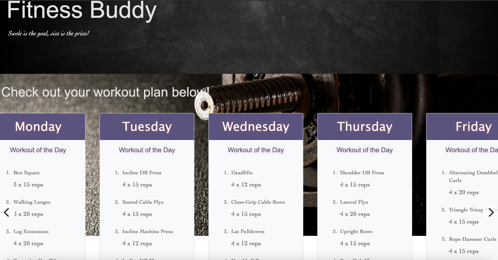

# Fitness Buddy
  
   
  ## Description
  :mag: A fitness application that allows users to create an account that comes with a fitness plan based on their goals. The user has a weekly calendar full of workouts specific to the type of fitness they aim to achieve.

  ## Table of Contents
  - [Description](#description)
  - [Installation](#installation)
  - [Usage](#usage)
  - [License](#license)
  - [Contributing](#contributing)
  - [Tests](#tests)
  - [Questions](#questions)
  ## Installation
  :floppy_disk: 
  clone the project (prerequisite: node.js, mysql, install dependencies) and run 'npm run watch' in your terminal and watch the Fitness Buddy come alive.
  ## Usage
  :computer:  Intened for users seeking a fitness plan with a wide range of exercises
  ## License
  
  This project was made without a license.
  ## Contributing
  :innocent: PR's welcome
  ## Tests
  :exclamation: 
    Run the application and create an account, log out and log back in and see your fitness plan has been saved.
  ## URL
https://fitness-buddy-2.herokuapp.com/
  ## Questions
  This will be standard for setting up a design team online.
  * Feel free to reach out to my email: hello1234@gmail.com
  * To see more of my work check out my github! The username is: connerc11
  * Also click the link to have easy access to the Github! (https://github.com/connerc11)
  # License